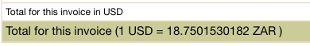

# Allocating AWS costs to a project

Instructions for a technical person to provide Finance with allocations of portions of AWS invoices to projects.

Resources like s3 buckets used for just one project should have a tag key `project` where the value is the project name, e.g. `gazettes`.

Resources that are shared need some way to apportion those costs between projects in a reasonably fair way.

Currently our biggest clearly allocatable cost is S3. We allocate the rest \(RDS, extra-aws transfer costs, etc\) according to the apps running on each EC2 server, and the size of those servers.

## Steps

### Create file for the new month

 \(the month that the costs were incurred - see "This invoice is for the billing period ..." on the invoice\)

Copy the latest allocations spreadsheet in the [AWS invoice allocations folder](https://drive.google.com/drive/folders/1FqRVxmUFCdhknIB8kwV2z4lOSPfjA0eS) and update the name for the month you're allocating

Prefix it with DRAFT until it's done, so that someone doesn't think you're done and uses the data when you're still updating last month's data.

Copy the exchange rate into the `ZAR in a USD` value cell on the Settings sheet

### Calculate the tax rate

Copy the tax-free `Charges` value into the `AWS Service Charges` `excl Tax` value cell and the `AWS Service Charges` value into the  `AWS Service Charges` `incl Tax` cell. We expect the tax rate to be around 15% 

### Allocate S3 costs

1. Visit the [S3 costs by project report](https://console.aws.amazon.com/cost-management/home?#/custom?groupBy=TagKeyValue:project&hasBlended=false&hasAmortized=false&excludeDiscounts=true&excludeTaggedResources=false&excludeCategorizedResources=false&excludeForecast=false&timeRangeOption=Last3Months&granularity=Monthly&reportName=S3%20costs%20by%20project%20-%20last%203%20months&reportType=CostUsage&isTemplate=false&filter=%5B%7B%22dimension%22:%22Service%22,%22values%22:%5B%22Amazon%20Simple%20Storage%20Service%22%5D,%22include%22:true,%22children%22:null%7D%5D&chartStyle=Stack&forecastTimeRangeOption=None&usageAs=usageQuantity&startDate=2020-01-01&endDate=2020-03-31&reportId=efc5673d-75ad-42a8-99b5-9e4ffdbc2361) in the AWS Cost Management console
2. Copy the total cost for the month to the `S3` `excl Tax` value cell on the Settings sheet.
3. Ensure significant projects are listed in the table on the S3 sheet
4. Copy the project totals for the month to the monthly $ cell of the S3 sheet
5. Verify that the S3 incl tax $ values match between the Settings and the S3 sheet

### Allocate EC2 and other costs

1. Ensure the EC2 instances list that the **servers sheet** reflects the servers that were running most of that month
2. Ensure that the apps running in AWS are reflected accurately on the **Apps sheet** for most of that month
   1. The apps that should be there are
   2. Removed apps are not there
   3. The server they're allocated to is correct
3. verify that the `Grand Total` `SUM of monthl USD incl tax` on the Apps sheet is the same as `EC2+Other` `USD incl Tax` on the Settings sheet

### Record project charges in Xero

1. Record costs on the S3 sheet
2. Record costs on the EX2 Project charges sheet
3. Allocate unknown to Core

