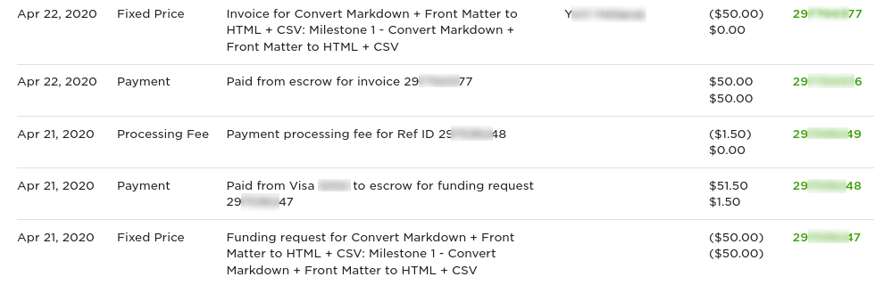
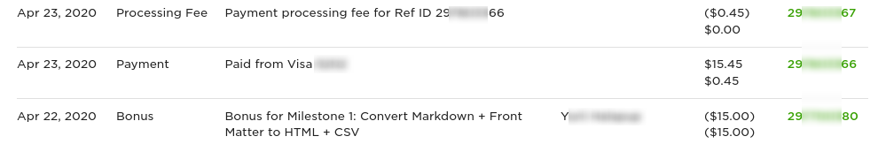

# Allocating Upwork transactions to projects

## Escrow transactions

1. Finance notes Upwork transactions during bank reconciliations
2. Finance logs the transactions in the [UpWork invoices spreadsheet](https://docs.google.com/spreadsheets/d/1AqRYya-bn4a18U2Oq_VeoETmO5grmHr7qRY3lW2cVxE/edit#gid=0)
3. Finance prompts Upwork recruiters to allocate new transactions in \#upwork slack channel
4. Upwork recuiters \(project tech leads, project managers\) look up the Invoice Number in the UpWork Invoices spreadsheet and match them to the REF ID column in the [UpWork Transaction history](https://www.upwork.com/ab/payments/reports/billing-history)
   1. Copy the Description from the transaction history to the spreadsheet, so it's easy to see which task it was
   2. Write the name of the Upwork recruiter in the Responsible field in the spreadsheet
   3. Write the project name in the Project field in the spreadsheet

## Non-escrow transactions

Just like escrow transactions, non-escrow transactions should be allocated to projects in the UpWork Invoices spreadsheet.

Non-escrow transactions, like time based weekly charges and bonuses do not clearly tie the transaction to the contract. If you can be 100% certain which contract, and thus which project it is from the transaction list, use that. Otherwise, get in touch with UpWork support and ask them to look up exactly which contract a transaction was for.

The screenshot above shows the bonus payment \(REF ending 80\) and the card deduction \(REF ending 66\) but unlike the card transaction into escrow shown above, the card transaction does not show a REF ID that ties it to a contract. When many such transactions are taking place for different projects for the same amounts, you can't make assumptions about which contract it's for. In this case, you can get in touch with UpWork support and ask them which contract the card payment with REF ID 29...66 \(you'd give them the full REF ID\) is for, so that we can allocate it to the correct project.

