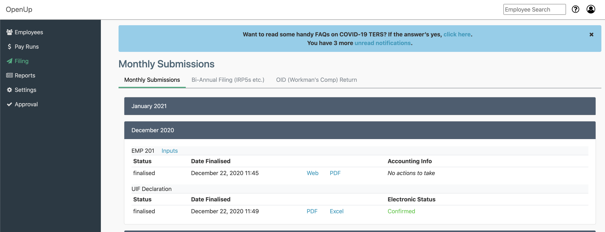
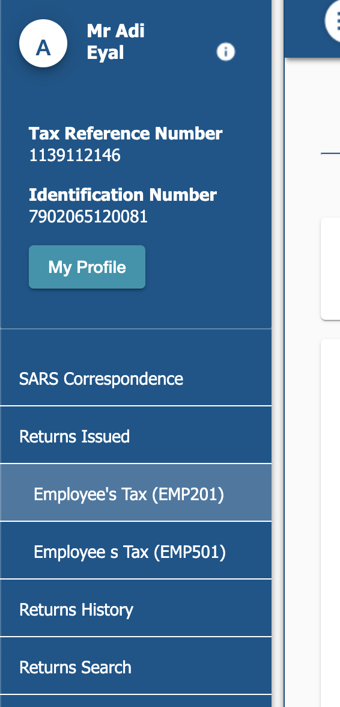
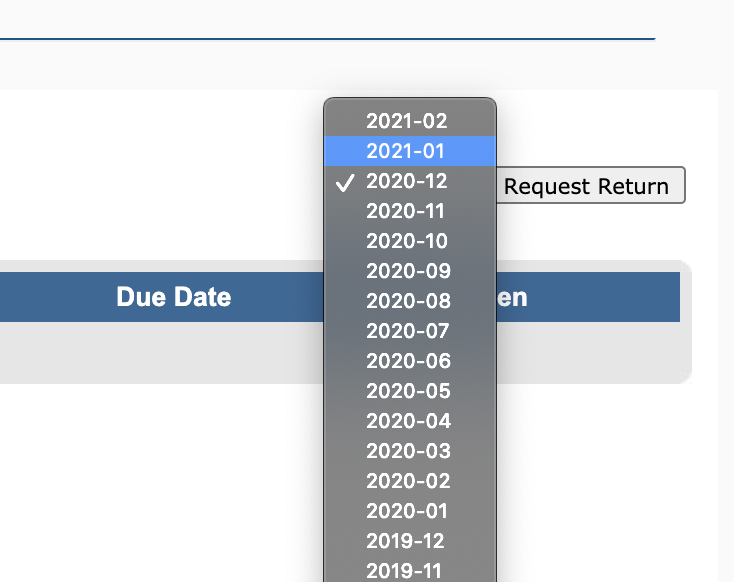
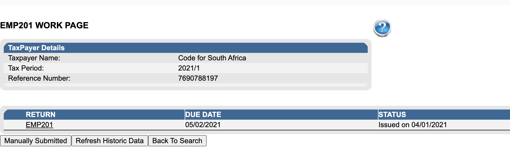
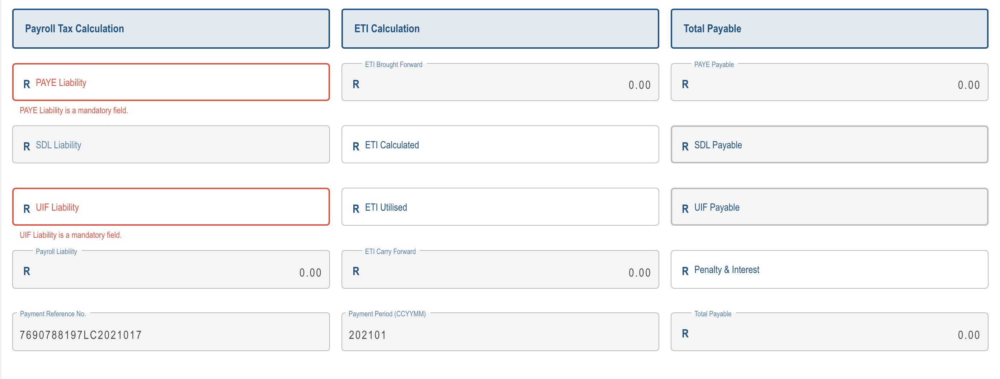
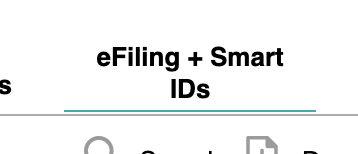
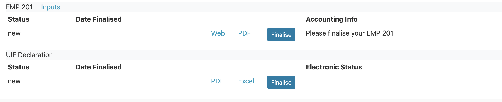

# PAYE and UIF

PAYE and UIF need to be paid with  7 days of the end of a month, e.g. taxes for May must be paid before the 7th of June. Late payment incurs a hefty 10% penalty and so we typically make payment on the 25th of the month along with the salary run.

To pay PAYE and UIF, an EMP 201 form needs to be completed. The steps to complete it are as follows:

1. Log into SimplePay and download the PAYE report
2. Log into SARS efiling and complete the EMP 201
3. Create a payment in efiling
4. Log into the bank account and pay

### SimplePay

Once a [pay run](broken-reference) has been finalised you can find a PAYE report in the **Filing** section.

.png>)

The information in this report will be needed to complete the EMP 201

### SARS eFiling

Using the PAYE report, log into [https://www.sarsefiling.co.za/](https://www.sarsefiling.co.za/).  Navigate to **Returns Issued -> Employees' Tax (EMP 201)**.  &#x20;

Select the correct period, i.e. the month for which the tax is due.

Click on **open** then click on **EMP 201**

This will open up the EMP 201 form. Use the SimplePay report to complete the form.

One you've finished it, click **File Return**

### Payment

Once that is done, click on Make Payment. This is ask you a million times whether you are sure. This will create an instruction in the FNB bank account to pay PAYE and UIF.&#x20;

Log into the bank account, in the **Payments section,** you will find an eFiling option. Click on that and you will see the payment instruction. Click **Pay.**

Congratulations, you've paid PAYE and UIF for this month!

### Back to SimplePay

The last step is to finalise in SimplePay. Navigate back to the **Filing** section. Click on **Finalise** for both PAYE and UIF for this month.

Now you're done!
