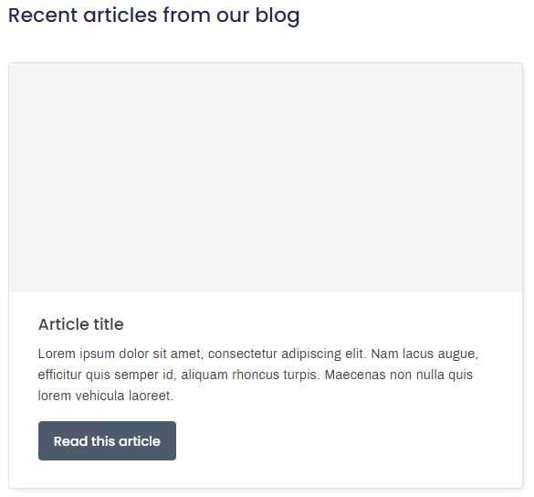

# Creating an email newsletter

## Login to Mailchimp

Visit [mailchimp.com](https://www.mailchimp.com) and login to the OpenUp account. Contact Shaun or Lailah if you are unsure of the account information.

## Create a new campaign

Go to Campaigns > All campaigns

Select "Create campaign"

Select "Email"

Create an "email"

## Choose the correct template

Choose "design email"

Choose "Saved templates" and select "OpenUp Newsletter Template"


&#x20;It is important that you **do not change any of the styling of this template** without contacting a member of the communications team.


## Customise the newsletter content

### Introduction

1. Adjust the issue number and date accordingly
2. Change the headline for the newsletter
3. Add the short 80-120 word "update" from a member of the management staff


**If you do not have an "update"** for this months newsletter, delete the block that it is in, leaving only the issue and the date.


### Survey

1. **Fill in the brief description** of what this month's survey is about (if required)
2. **Replace "Survey question"** with the question you would like to ask
3. **Enter the "Source" mode** (<>) and duplicate the following code for as many answers as you would like `
*|SURVEY: Survey response 1|*
`
4. Change "Survey response 1" to the answer you would like to add


Mailchimp automatically detects these survey answers as long as the \*|SURVEY:|\* element is present. You can review the results of the survey in the campaign information.



If you do not have a survey for the month, delete the block the survey sits in


### Recent blog articles


By default, the template has 4 blog post blocks built in. If you would like to add more, please contact a member of the comms team. If you would like to remove any, simply delete the template blocks you don't.&#x20;


1. **Enter "Source" mode** (<>) to adjust the text for all the elements of the blog post preview card
2. Change "**Article Title**" and "**Article Summary**" to reflect the contents of the blog
3. **Update the href** ("#nourl" by default) field in the line below with the url of the article you would like to link to `<a class="article-button" href="#nourl">Read this article</a>
`
4. Update the url field in this line `background-image: url("") !important;` with the url of the blog's feature image.&#x20;


**Do not try to add an image to the blog post block - always use a URL.** This will increase the size of the email and might cause the email to not be able to be received.&#x20;


## Need help?

**This guide is not yet complete!** If you have any problems, please contact Matthew on the Comms team.
