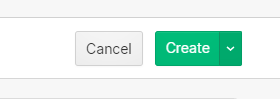
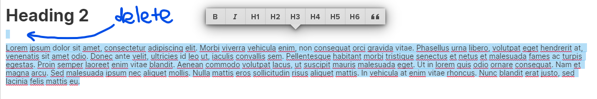

# Posting a blog

## Login to the site as a contributor

Visit this URL and wait for the prompt to login as a content contributor:



Please request the login details from Shaun Russell or find the login credentials on the OpenUp credentials page.

## Add a blog post in the CMS

1.Click the collections tab in the bottom left:

2. Select "Blog Posts" from the list:

3. Add a new blog post in the top right:

4. Follow the guidelines in the next section when completing this process and use the checklist before publishing the article.

5. When you are finished, "Create" the article \(the post will not be live until it is published\):

6. When the article has been created, you can share it with a member of the communications team for them to sign-off on before publishing.

## Custom options for your post

### 1. Author name

If you are a regular contributor, your name will be populated in the CMS and will show up in "Blog authors". If you are a once-off contributor, use the "Author name" field. If you are going to be posting multiple posts, please talk to a member of the comms team to have your profile added to the authors list.

### 2. Alternative post layouts

If you do not specifically want your post to have a layout other than the default, please leave field unchanged.

#### Full width:

Full-width removes the sticky section on the left side of the post and widens the post area. This should be used when large graphics are required \(like data visualisations\).

### 3. Categories

Categories are site wide and are ways of logically grouping content to ensure that it is able to be shown in specific locations. eg. posts relating to a specific tools showing up on that tools page.

You can select multiple categories for a post, but please ensure that your selections make logical sense. 


**IF UNSURE** what category to use on your post, please contact a member of the comms team.


## Checklist for posting an article

### 1. My document is only using existing copy styles:

Do not use any alternative fonts when structuring your post.


The styles in the post editor **DO NOT** represent how the post will appear on the live site. **DO NOT** try to tailor the spacing or font styles to represent how you _think_ the post should look.


### 2. Follow a linear heading structure

Start your article heading structure with a "H2" and then use logical subheadings when needed \(H2 &gt; H3 &gt; H4\). H1 is reserved for the titele. Do not try to "style" the size of your post using heading styles. eg. Don't say, "I want this heading to be a bit smaller, so I am going to make it a H3". Headings are used to convey article structure.

### 3. Remove "extra" spaces in your post

Make sure that there aren't hard returns between elements


**DO NOT add line breaks** \(hit enter\) between headings, paragraphs or images in order to make the post look "correct" in the post editor. The spacing has been designed to look correct on the published post.


### 4. Images are at the correct size

Please ensure that you are using high quality images that are saved a reasonable size to ensure that they look good on all devices. Some basic guidelines are:

#### **Feature images:**


**1280px x 800px** \(recommended\) with a **file size of 450kb**


#### **Post images:**


**800px wide** \(recommended\) with a **file size of 450kb**


### 5. Images are using the correct layout

Make sure you are selecting an appropriate layout for your images. By default, the image will be centered in the body of the post at the size it was uploaded. 

### 6. Do not repeat the header image in the body of the post

If you want to add an image to the body of the post, the image should be different to the header image.


For large images, **use the full-width option**.


Once your blog has been posted you need to share it on social media. Go to the "Sharing a Blog Post" page [here](sharing-a-blog-post.md). 

