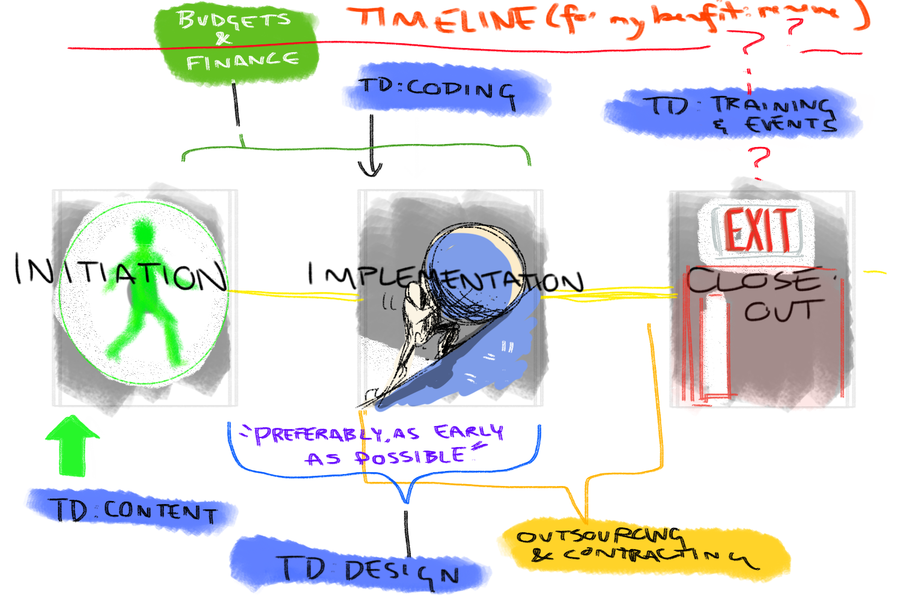

# Tool Development

## Orienteering: Where Tool Development Lands Amidst The Project Process

## The sectors of Tool Development in relation to the project process

Design- tends to be pulled into the process whenever needed. Ideally, Design should be involved as early as possible. 

## Coding

1. **What do you do in OpenUp’s Tool Development department? What’s the extent of your tasks?**
2. **What kind of technology does OpenUp utilize?**
3. **Where does Tool Development fall in relation to the Project Initiation/Implementation phase?**
4. **What metrics- if any- do you use to assess and review software?** 

\*\*\*\*

\*\*\*\*

## Design

## Content, Writing & Media

## Training and Events

