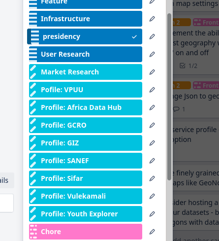

# Project boards

We use project boards to track the deliverables and activities on a project.

We usually use Trello.

We should consider using Taiga since it provices classic Scrum swimlanes to group tasks alongside the user story they are implementing.

## Trello best practices

Do

* Use a common colour for related labels
  * e.g. All \(and only\) Profile names are the colour with the diagonal lines
* Use a common prefix for related labels
  * e.g. `Profile:`  below

Don't

* Use a different colour for each instance of a related set of labels
  * e.g. Presidency and GIZ
  * e.g. Feature and Chore
* Don't reuse a colour for a different type of label, if posible
  * If you have to do so, use the prefixes to distinguish them.

