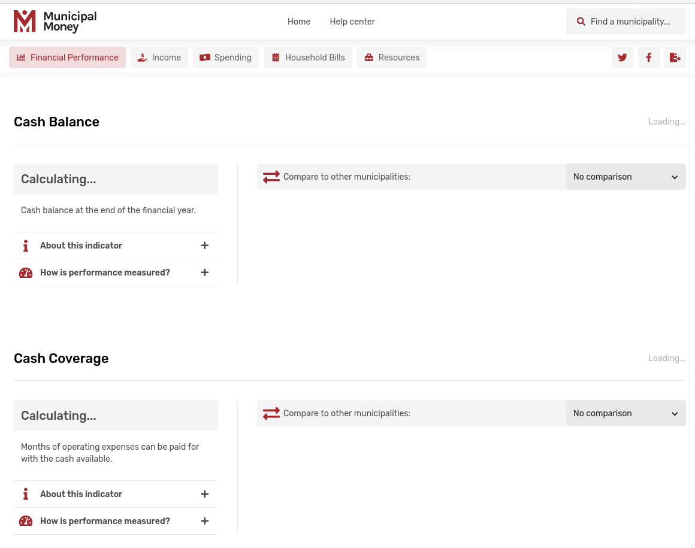
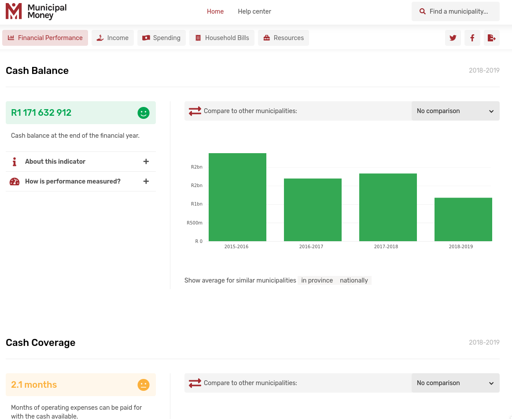
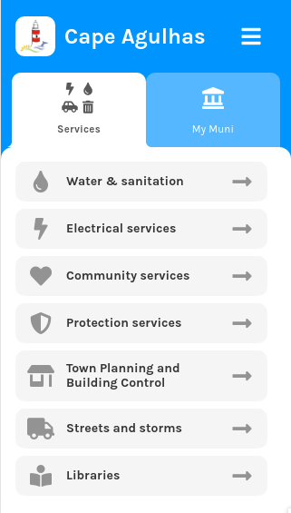
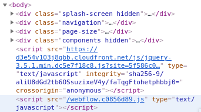
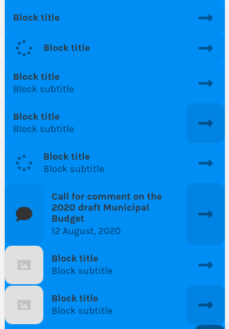
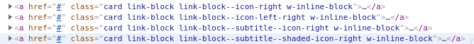
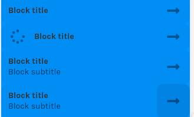

# Webflow pages with custom javascript presenting data

We often build the CSS, markup and some interactivity using Webflow. We then insert custom javascript - usually to show data from an API by manipulating the DOM and injecting the data.

This approach works for sites hosted by Webflow, as well as webflow sites exported as Zip files then hosted elsewhere. When using exported sites, we generally prefer unpacking the site using [import-webflow-export](https://www.npmjs.com/package/import-webflow-export).

We refer to "components" as units of markup that can be reused. Components could be used [in-place](custom-dom-manipulation-in-webflow-sites.md#in-place-components), or included in the page in a hidden `div` as components in a "component library" and [cloned](custom-dom-manipulation-in-webflow-sites.md#cloned-components) as many times as needed.

By building components as [Webflow Symbols](https://university.webflow.com/lesson/symbols), we can update the design of the component across the site by editing it in just one place.

### General best practices

* It must be possible to select \(the DOM element of\) a component uniquely using javascript **without resorting to selecting the n-th item of a number of matches.**
* Charts should be as wide as their container and as long as is appropriate by design or configuration, possibly dynamic in height to accommodate wrapping text or other features. Chart containers should usually allow their hight to be determined by their content.
* Never include demo/dummy/example content e.g. lorem ipsum text or example data values - especially not in in-place components that can be seen while javascript is loading or if a javascript error results in failure to replace the demo content.
* Use skeletons or "loading..." sort of text so that the page content looks nice and doesn't dramatically jump around while javascript and dynamically-fetched data loads and components start being placed on screen.

## In-place components

### Usage

In-place components are ideal for

* Page menu, hero, header, footer
* Sections that don't really change frequently or where there is no demand for maintaining them using a CMS because there are other system changes necessary to change them

### Example

In the example below:

* the Cash Balance and Cash Coverage sections are two instances of a Section component.
* The blocks showing "Calculating..." actually gets replaced by a cloned component depending on whether the rating is good or bad - but the data-driven differences could be represented by changing classes in that element in-place as well.
* The header and in-page nav are also in-place components
* The search box has javascript events attached by custom javascript to handle search interaction
* The social sharing and export buttons on the top right have javascript events attached by custom javascript as well
* The chart is inserted by providing a reference to the chart container to the chart library, where the chart renders itself as wide as the container allows, and as long as the chart is designed or configured to be, possibly depending on its width.





### Best practices

* Use an ID to uniquely identify each instance of a component - e.g. `#cash-coverage` and `#cash-balance` above
* Don't use an ID to identify the components or elements inside a component identified by an ID - e.g. the chart container above has the class `chart-container`
  * All chart containers can be selected using `.chart-container`
  * A specific chart container can be selected using `#cash-coverage .chart-container` or as a child of a reference you already have to the ID-identified element `$("#cash-coverage").find(".chart-container")`
  * Using an ID to identify all these nested elements would result in an unnecessary maintenance burden and a good chance of duplicating IDs.

## Cloned components

Cloned components are usually included in a hidden `div` used as a component library. They are cloned as needed, usually using the jquery method `$element.clone()` e.g. `const $element = $(".components .some-component").clone();` where .components is the hidden div component library.

### Usage

Cloned components are ideally used

* you have a variable number of instances of a component based on data or user interaction
* you use different iterations of the same component for a finite number of different styles \(indicator ratings with smiley faces in the example above\)

### Example

In the example below

* Each service button is an instance of a cloned "link block" component cloned from the component library and populated text, icon and URL based on a response from an AJAX request to a CMS API.
* The heading, menu and tab content area are in-place components
* The tab buttons are dynamically created and populated with icon, label and a javascript click event handler to a function that lets the controller update what is shown on the tab content area.





By removing the `hidden` class, the component variations can be seen with their placeholder/example text and icons



Variations of the same cloned component should be distinguished using distinct class names. Using distinct templates for all the variations of a component can become excessive. At some point modifier classes for things like shading or enabling/disabling left/right icons might be easier to maintain. Those modifier classes should then be documented clearly and considered a contract between the webflow developer and the javascript developer which requires discussion to change, to avoid surprises.






### Best practices

* Use unique class names for each variation of a component.
* Never access variations of a component using some kind of n-th lookup like javascript `matches[2]` or jQuery `$(".components .link-block:eq(2)")` since updates to the component library can result in surprise changes in the arrangement of template components.
* Do not use IDs on cloned components - that will require the javascript developer to strip the ID after cloning and might have unintended consequences. A page should not have more than one element with the same ID at the sametime.
* Use a demo page that is not accessible by public site users to demonstrate how the component should be used, what it looks like, etc.
* Document modifier classes and treat them as a contract between the webflow and javascript developer.
* Document which components are intended to be children of which other components \(which often entails assumptions about margins and padding\)
* Keep a reference in javascript to the root element of a cloned component if you will need to modify it after initial setup

### Patterns

A nice pattern for javascript representing cloned components is to use a javascript class

```javascript
class SomeComponent {
  constructor(someContent) {
    this.$element = $(".components .some-component");
    logIfUnequal(1, $element.length); // easily identify failed template lookup
    // some setup
    this.$element.find(".some-nested-content-container").text(someContent);
    // more setup
  }
  render() {
    return this.$element;
  }
}
```

Component classes can nest and extend components

```javascript
export class CouncillorGroupPage extends Page {
  constructor(content) {
    super(content);
    this.members = content.councillors;
    this.membersLabel = content.members_label;
  }

  render() {
    return [
      new PageTitle(this.name).render(),
      new Breadcrumbs(this.breadcrumbItems).render(),
      ...this.renderProfileImage(),
      ...this.renderOverview(),
      ...this.renderCouncillorLinks(),
      ...this.renderContacts(),
      ...this.renderChildPageLinks(),
    ];
  }
  
  renderProfileImage() {
    // ...
  }
  // ...
}
```

Bind `this` in callback functions to ensure it continues to refer to the component class instance

```javascript
class ClickableComponent {
  constructor() {
    this.$element = $("...");
    this.$element.on("click" (() => {
      this.$element.toggleClass("something");
    }).bind(this);
  }
}
```

Re-initialise webflow interactions each time after inserting cloned elements that have Webflow interactions so that the interaction event handlers get bound to those elements.

```javascript
Webflow.require('ix2').init();
```

